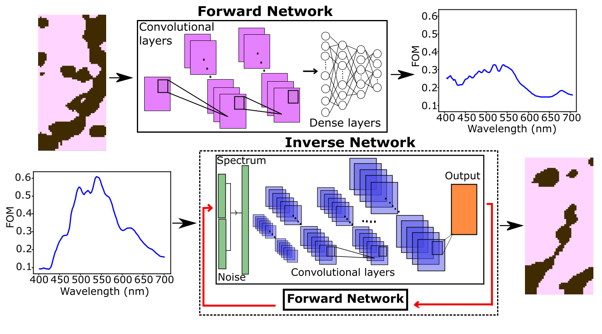

# Hybrid Deep Learning for Design of Nanophotonic Quantum Emitter Lenses

This repository presents the methodology and machine learning driven design framework associated with the research work:

***Hybrid Deep Learning for Design of Nanophotonic Quantum Emitter Lenses***.

The project focuses on leveraging **hybrid deep learning architectures** and **optimization** approach to design nanophotonic quantum emitter lenses that improve light emission and device performance.

---

## Overview

The project uses a hybrid deep learning framework for the inverse design of nanophotonic quantum emitter lenses, combining tandem neural network approach with physics based optimization to efficiently design high performing structures. 

The goal is to improve the directivity of light by generating lens geometries that would be difficult to find through computationally expensive conventional optimization techniques alone. By integrating  machine learning with adjoint optimization technique, the approach aims to generate high performing nano lens structures that are possible to fabricate. 


---

## Project Objectives

* **Hybrid Model Development**
  Develop and evaluate hybrid deep learning models that combine conventional adjoint optimization concepts with tandem neural network approach for nanophotonic lens design.

* **Forward and Inverse Design**
  Learn mappings between nanophotonic lens geometries and optical responses relevant to quantum emitters.

* **Design Acceleration**
  Reduce the computational cost of lens optimization by replacing iterative solvers with fast ML based surrogates.

* **Performance Validation**
  Validate ML generated designs against full wave electromagnetic simulations.

---

## Methodology

### 1. Physics-Based Data Generation

* **Simulation Method**: Finite Difference Time Domain (FDTD)

* **Electromagnetic Solver**: Meep

* **Physical System**:

  * Quantum emitter modeled as a dipole source
  * Nanophotonic lens structures designed to control the directivity of light

* **Structure Representation**:

  * Discretized 2D permittivity maps

---

### 2. Hybrid Deep Learning Framework

* **Forward Models**
  Neural networks trained to predict optical metrics from lens geometries.

* **Inverse Models**
  Networks trained to generate lens designs that meet target emission responses.

* **Hybrid Strategy**

  * Utilizing conventional optimization technique to generate initial dataset to trian the networks.
  * Coupling between forward and inverse networks to stabilize training and resolve non unique solutions.

* **Optimization Loop**
  ML predicted designs are validated and refined using full wave simulations.

---

## Key Results

* **High-Performance Lens Designs**
  The hybrid deep learning framework successfully generated nanophotonic lenses with strong directivity and enhanced collection efficiency for quantum emitters.

* **Acceleration Over Traditional Methods**
  Design times were reduced by orders of magnitude compared to purely simulation driven optimization.

* **Robust Generalization**
  Trained models demonstrated the ability to generate effective lens geometries that work for wavelength ranges outside of the training configuration region. 

* **Physics Consistency**
  ML generated designs closely matched full wave simulation results, confirming physical validity.

---

## Figures and Visualizations

Key figures related to lens geometries, emission profiles, and model performance are provided in the **`results/`** directory.

---

## Tech Stack

* **Programming Language**: Python
* **Machine Learning**: TensorFlow / Keras, Scikit-learn
* **Electromagnetic Simulation**: Meep (FDTD)
* **Data Processing & Visualization**: NumPy, Pandas, Matplotlib

---

## Data Access

* **Simulation Data**: Generated using FDTD and available upon reasonable request.
* **Reuse & Collaboration**: Please contact the author for commercial use or collaborative research opportunities.

---

## Citation

If you use this repository in academic work, please cite the corresponding paper:

```bibtex
@article{HybridDLQuantumEmitter,
  title   = {Hybrid Deep Learning for Design of Nanophotonic Quantum Emitter Lenses},
  author  = {Acharige, Didulani and Johlin, Eric},
  journal = {To be updated},
  year    = {To be updated}
}
```

---

## Contact

**Didulani Acharige**
Department of Mechanical and Materials Engineering
Western University
Email: [dsalwath@uwo.ca](mailto:dsalwath@uwo.ca)
